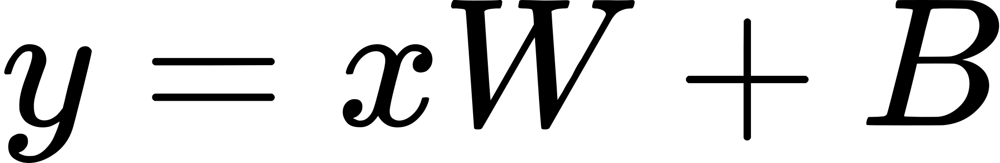
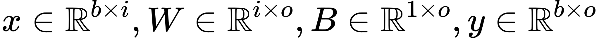
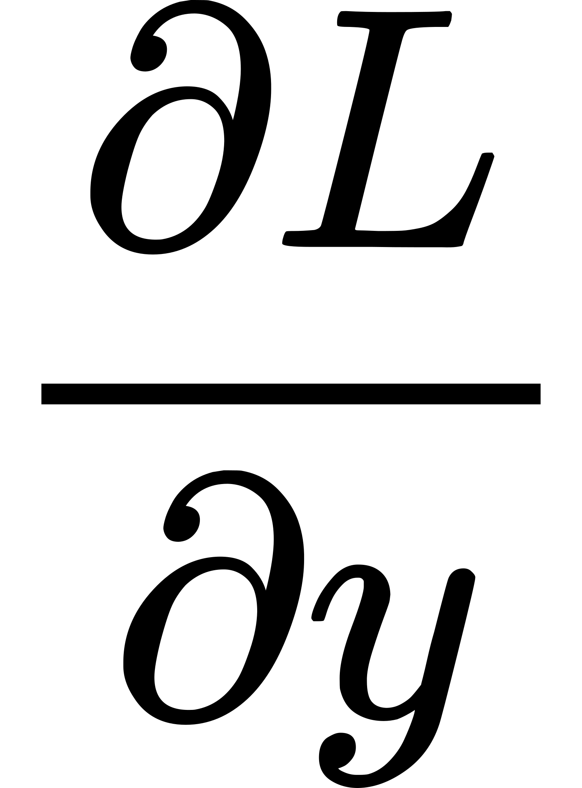
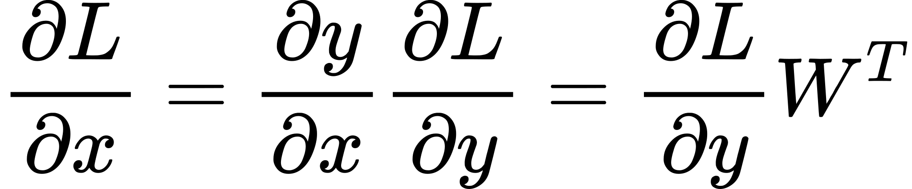
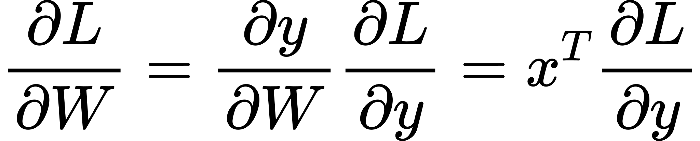
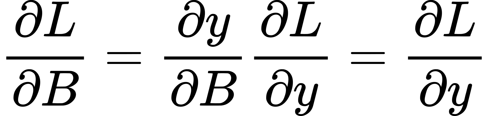
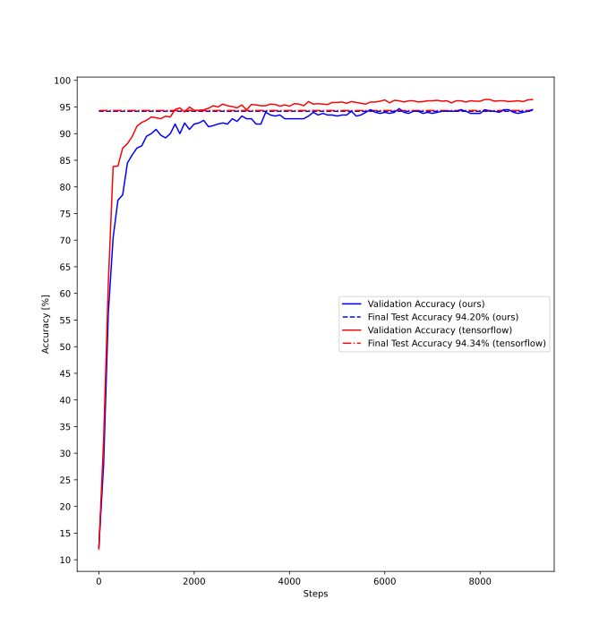

# (MNIST) Digit Classifier using MLP from scratch


## About

If you are looking for a blazingly fast digit classifier with the most polished API and the capability to deploy to some obscure mobile device... I recommend you better look elsewhere. :smile:
However, if you are interested in understanding how image classification and error backpropagation work, this might be the place for you.

When working with modern Deep Learning frameworks such as [Tensorflow](https://github.com/tensorflow/tensorflow) or [PyTorch](https://github.com/pytorch/pytorch), it can sometimes be difficult to see what is actually going on under the hood.
This repository contains easily understandable implementations of a Dense Layer, LeakyReLU & Sigmoid Activation Layer, as well as Softmax-CrossEntropy Loss without using any 3rd party code. (except for the unittest framework [Catch2](https://github.com/catchorg/Catch2)).
All components, including the matrix operations are written in C++ from scratch.

## Build & Run

### Build requirements

* cmake >= 3.10
* make (or ninja)
* C++ compiler (C++17 support required)

### Steps to build

```bash
git clone --recursive https://github.com/baurst/mlp_from_scratch_cpp.git
mkdir build
cd build
cmake .. -DCMAKE_BUILD_TYPE=Release  # for debug build use -DCMAKE_BUILD_TYPE=Debug
make -j4

# to run the tests
./test/tests
```

### Steps to run

```bash
# download MNIST dataset as .csv (or alternatively from kaggle.com: https://www.kaggle.com/oddrationale/mnist-in-csv)
wget https://pjreddie.com/media/files/mnist_train.csv
wget https://pjreddie.com/media/files/mnist_test.csv

# train the classifier by providing absolute paths to datasets as arguments
./src/main mnist_train.csv mnist_test.csv
```

## Explanation

### Backpropagation

For each train step, the train method of the MLP is called with a mini-batch of flattened images and corresponding labels, called input & target.

```C++
float MLP::train(const Mat2D<float>& input, const Mat2D<float>& target,
                 const Loss& loss_obj, const float learning_rate) {
```

First, the forward pass is performed, i.e. the activations of each layer for the mini-batch "input" are stored like so:

```C++
  const auto activations = this->forward(input);
  const auto logits = activations.back();
```

In the backward pass, we propagate the gradient of the loss w.r.t. to its input back through the network to update the weights.
As the name suggests, backpropagation starts at the back of the computation graph, in our case from the loss layer.
During the backward pass, each layer updates its trainable variables with the gradient (scaled by the learning rate) and returns the gradient of the loss w.r.t. its inputs:

```C++
  auto grad = loss_obj.loss_grad(logits, target_label);

  for (int32_t layer_idx = this->layers.size() - 1; layer_idx >= 0;
       --layer_idx) {
    const auto layer_input = activations[layer_idx];
    grad = this->layers[layer_idx]->backward(layer_input, grad, learning_rate);
  }
```

(For details on how each layer implements the backward method, see below or [./src/layer/layer.cpp](https://github.com/baurst/mlp_from_scratch_cpp/blob/master/src/layer/layer.cpp).)
The weight update for this mini-batch is now complete.
Finally, the loss is returned for logging purposes.

```C++
  const auto loss = loss_obj.loss(logits, target_label);
  const auto avg_loss = loss.reduce_mean();
  return avg_loss;
}
```

### Gradients of Dense Layer

<sub><sup>(Apologies for the weird math typesetting, but Github Markdown does not support LaTeX math at the moment.)</sup></sub>

To optimize the network we need to compute the weight updates and propagate the gradient backwards.
The activation of the Dense Layer is as follows:

<!-- $$
y = xW + B
$$ -->

<div align="center"></div>


<!-- $$
x \in \Bbb R^{b \times i}, W \in \Bbb R^{i \times o}, B \in \Bbb R^{1 \times o}, y \in \Bbb R^{b \times o}
$$ -->

<div align="center"></div>

where W, B are the weight and bias matrices of the dense layer, x is the batched input and y the batched output.
b is the number of processed batches, o is the number of neurons in the layer, the input features x are of depth i.

We would like to backpropagate the loss gradient from the output of the layer

<!-- $$
\frac{\partial L}{\partial y}
$$ -->

<div align="center"></div>

backwards to pass it to the previous layer.
Using the chain rule we get:

<!-- $$
\frac{\partial L}{\partial x} = \frac{\partial y}{\partial x} \frac{\partial L}{\partial y} = \frac{\partial L}{\partial y} W^{T}
$$ -->

<div align="center"></div>

To update the weights and bias terms of the layer itself using the chain rule we get

<!-- $$
\frac{\partial L}{\partial W} = \frac{\partial y}{\partial W} \frac{\partial L}{\partial y} = x^{T} \frac{\partial L}{\partial y}
$$ -->

<div align="center"></div>

and

<!-- $$
\frac{\partial L}{\partial B} = \frac{\partial y}{\partial B} \frac{\partial L}{\partial y} = \frac{\partial L}{\partial y}
$$ -->

<div align="center"></div>

for the bias term.
These gradients can then be scaled with the learning rate and subtracted from the current weight/bias matrices for simple gradient descent optimization.

```C++
Mat2D<float> DenseLayer::backward(const Mat2D<float>& input,
                                  const Mat2D<float>& gradients_output,
                                  const float learning_rate) {
  const auto grad_input =
      gradients_output.dot_product(this->weights.transpose());
  const auto grad_weights = input.transpose().dot_product(gradients_output);
  const auto grad_biases = gradients_output.reduce_sum_axis(0);

  const auto lr_mat = Mat2D<float>(1, 1, {learning_rate});
  const auto weight_update = lr_mat.hadamard_product(grad_weights);
  const auto bias_update = lr_mat.hadamard_product(grad_biases);
  this->weights = this->weights.minus(weight_update);
  this->biases = this->biases.minus(bias_update);

  return grad_input;
}

```

## Performance comparison with tensorflow

As of now, the network achieves a test accuracy of 94.2% using two Dense Layers with 50 and 25 neurons each and Leaky ReLU activation (alpha=0.1), SGD with learning rate 0.01 (with decay) and a batch size of 64.
An identical classifier has been implemented using tensorflow in [./plot/tf_mlp.py](https://github.com/baurst/mlp_from_scratch_cpp/blob/master/plot/tf_mlp.py), achieving the same test accuracy.



The run the tensorflow implementation and/or generate this plot follow the instructions given in [./plot/Readme.md](https://github.com/baurst/mlp_from_scratch_cpp/blob/master/plot/Readme.md).

## Implement your own layer

Should you wish to add your own layer you can simply write a class that inherits from the class [Layer](https://github.com/baurst/mlp_from_scratch_cpp/blob/master/src/layer/include/layer.h#L7), implement the forward and backward pass and drop it into your model.
Have fun tinkering!
