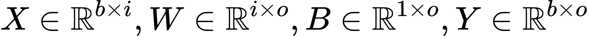

# (MNIST) Digit Classifier using MLP from scratch


## Overview

1. [About](#about)
2. [Build & Run](#build)
    * [Build Requirements](#requirements)
    * [Steps to Build](#build_steps)
    * [Steps to Run](#run_steps)
3. [Explanation](#explanation)
    * [Brief Overview over Backpropagation](#backprop_overview)
    * [Gradients of Dense Layer](#backprop_dense)
4. [Performance Comparison with Tensorflow](#performance)
5. [Implement Your Own Layer](#own_layer)

## <a name="about"></a> About

<!-- If you are looking for a blazingly fast digit classifier with the most polished API and the capability to deploy to some obscure mobile device... Please look elsewhere. :smile:
However, if you are interested in understanding how image classification and error backpropagation work, this repo might be helpful. -->

When working with modern Deep Learning frameworks such as [Tensorflow](https://github.com/tensorflow/tensorflow) or [PyTorch](https://github.com/pytorch/pytorch), it can sometimes be difficult to see what is actually going on under the hood.
This repository contains easily understandable implementations of a Dense Layer, LeakyReLU & Sigmoid Activation Layer, as well as Softmax-CrossEntropy Loss for batched inputs.
Batched input means that the implementation can process multiple images simultaneously, a feature that is often omitted for simplicity from other educational implementations.
In my opinion, the added complexity of describing the computations using batched tensors instead of for loops is well worth it, as it more closely follows current Deep Learning frameworks.

This implementation deliberately does not use any 3rd party libraries/code (except for [Catch2](https://github.com/catchorg/Catch2) as unittest framework ).
As an exercise, all components including the matrix operations have been written in C++ from scratch.
Besides providing educational value this project was also an exercise for me, in order to prevent my C++ from getting all too rusty (pun very much intended ... 🦀.)

The achieved test accuracy is on par with tensorflow, see section [Performance comparison with tensorflow](#performance)

## <a name="build"></a> About Build & Run

Building and running should be easy for anyone with a C++17 compatible toolchain.

### <a name="requirements"></a> Build Requirements

* cmake >= 3.10
* make (or ninja)
* C++ compiler (C++17 support required)

### <a name="build_steps"></a> Steps to Build

```bash
git clone --recursive https://github.com/baurst/mlp_from_scratch_cpp.git
mkdir build
cd build
cmake .. -DCMAKE_BUILD_TYPE=Release  # for debug build use -DCMAKE_BUILD_TYPE=Debug
make -j4

# to run the tests
./test/tests
```

### <a name="run_steps"></a> Steps to Run

```bash
# download MNIST dataset as .csv (or alternatively from kaggle.com: https://www.kaggle.com/oddrationale/mnist-in-csv)
wget https://pjreddie.com/media/files/mnist_train.csv
wget https://pjreddie.com/media/files/mnist_test.csv

# train the classifier by providing absolute paths to datasets as arguments
./src/main mnist_train.csv mnist_test.csv
```

## <a name="explanation"></a> Explanation

### <a name="backprop_overview"></a> Brief Overview over Backpropagation

For each train step, the train method of the MLP is called with a mini-batch of flattened images and corresponding labels, called input & target.

```C++
float MLP::train(const Mat2D<float>& input, const Mat2D<float>& target,
                 const Loss& loss_obj, const float learning_rate) {
```

First, the forward pass is performed, i.e. the activations of each layer for the mini-batch "input" are stored like so:

```C++
  const auto activations = this->forward(input);
  const auto logits = activations.back();
```

In the backward pass, we propagate the gradient of the loss w.r.t. to its input back through the network to update the weights.
As the name suggests, backpropagation starts at the back of the computation graph, in our case from the loss layer.
During the backward pass, each layer updates its trainable variables with the gradient (scaled by the learning rate) and returns the gradient of the loss w.r.t. its inputs:

```C++
  auto grad = loss_obj.loss_grad(logits, target_label);

  for (int32_t layer_idx = this->layers.size() - 1; layer_idx >= 0;
       --layer_idx) {
    const auto layer_input = activations[layer_idx];
    grad = this->layers[layer_idx]->backward(layer_input, grad, learning_rate);
  }
```

(For details on how each layer implements the backward method, see below or [./src/layer/layer.cpp](https://github.com/baurst/mlp_from_scratch_cpp/blob/master/src/layer/layer.cpp).)
The weight update for this mini-batch is now complete.
Finally, the loss is returned for logging purposes.

```C++
  const auto loss = loss_obj.loss(logits, target_label);
  const auto avg_loss = loss.reduce_mean();
  return avg_loss;
}
```

### <a name="backprop_dense"></a> Applied Backpropagation: Gradients of Dense Layer

<sub><sup>(Apologies for the weird math typesetting and to dark-mode users, but Github Markdown does not support LaTeX math at the moment.)</sup></sub>

To optimize the network we need to compute the weight updates and propagate the gradient backwards.
```C++
Mat2D<float> DenseLayer::backward(const Mat2D<float>& input,
                                  const Mat2D<float>& gradients_output,
                                  const float learning_rate) {
```

The activation of the Dense Layer is as follows:

<!-- $$
Y = XW + B
$$ -->

<div align="center"></div>

<!-- $$
X \in \Bbb R^{b \times i}, W \in \Bbb R^{i \times o}, B \in \Bbb R^{1 \times o}, Y \in \Bbb R^{b \times o}
$$ -->

<div align="center"></div>

where W, B are the weight and bias matrices of the dense layer, X is the batched input and Y the batched output.
b is the number of processed batches, o is the number of neurons in the layer, the input features X are of depth i.

During training, a scalar loss L is computed that we would like to minimize.
For gradient based optimization we need to compute the gradients of the loss w.r.t. each layer input X, weights W and biases B for each layer in the network.

To backpropagate the loss gradient from the output of the layer (```gradients_output```)

<!-- $$
\frac{\partial L}{\partial Y} = \begin{bmatrix}
    \frac{\partial L}{\partial y_{00}} & \frac{\partial L}{\partial y_{01}} & \dots \\
    \vdots & \ddots & \\
    \frac{\partial L}{\partial y_{b0}} &        & \frac{\partial L}{\partial y_{bo}}
    \end{bmatrix}
$$ -->

<div align="center"></div>

backwards to the previous layer (called ```grad_input``` from hereon), we apply the chain rule.
Each entry of ```gradients_output``` contains the partial derivative of the Loss w.r.t. each entry of the output matrix Y.
Consequently, we need to compute ```gradients_input```, which must contain each partial derivative of the loss w.r.t. each entry in the input matrix X:

<!-- $$
\frac{\partial L}{\partial X} = \frac{\partial Y}{\partial X} \frac{\partial L}{\partial Y} =~...~= \frac{\partial L}{\partial Y} W^{T}
$$ -->

<div align="center"></div>

This conveniently translates to C++ like so:

```C++
  const auto grad_input =
      gradients_output.dot_product(this->weights.transpose());
```

To update the weights W of the layer itself using the chain rule we get

<!-- $$
\frac{\partial L}{\partial W} = \frac{\partial Y}{\partial W} \frac{\partial L}{\partial Y} =~...~= X^{T} \frac{\partial L}{\partial Y}
$$ -->

<div align="center"></div>

, or in code:

```C++
  const auto grad_weights = input.transpose().dot_product(gradients_output);
```

and for the bias term

<!-- $$
\frac{\partial L}{\partial B} = \frac{\partial Y}{\partial B} \frac{\partial L}{\partial Y} = \frac{\partial L}{\partial Y}
$$ -->

<div align="center"></div>

, which translates to

```C++
  const auto grad_biases = gradients_output.reduce_sum_axis(0);
```

These gradients can then be scaled with the learning rate and subtracted from the current weight/bias matrices for simple gradient descent optimization.

```C++
  const auto weight_update = grad_weights.hadamard_product(learning_rate);
  const auto bias_update = grad_biases.hadamard_product(learning_rate);
  this->weights = this->weights.minus(weight_update);
  this->biases = this->biases.minus(bias_update);
```

Finally, the gradient at the output of the previous layer is returned,

``` C++
  return grad_input;
}
```

so that the backpropagation algorithm can be continued all the way to the input of the network.

By the way: The activation functions are treated like separate layers, which in turn implement the forwards & backwards functions.

## <a name="performance"></a> Performance Comparison with Tensorflow

As of now, the network achieves a test accuracy of 94.2% using two Dense Layers with 50 and 25 neurons each and Leaky ReLU activation (alpha=0.1), SGD with learning rate 0.01 (with decay) and a batch size of 64 on the MNIST test set.
An identical classifier has been implemented using tensorflow in [./plot/tf_mlp.py](https://github.com/baurst/mlp_from_scratch_cpp/blob/master/plot/tf_mlp.py), achieving the same test accuracy.


To run the tensorflow implementation and/or generate this plot follow the instructions given in [./plot/Readme.md](https://github.com/baurst/mlp_from_scratch_cpp/blob/master/plot/Readme.md).

## <a name="own_layer"></a> Implement Your Own Layer

Should you wish to add your own layer you can simply write a class that inherits from the class [Layer](https://github.com/baurst/mlp_from_scratch_cpp/blob/master/src/layer/include/layer.h#L7), implement the forward and backward pass and drop it into your model.
Have fun tinkering!
